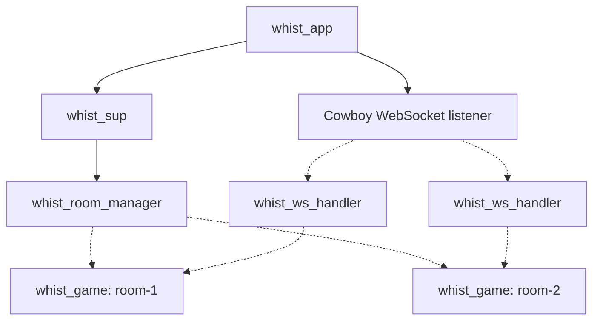
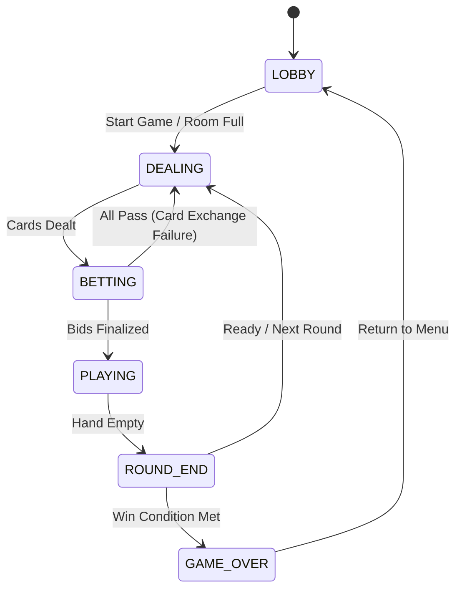

# Whist Backend Documentation

This document provides a detailed technical overview of the Whist game backend, written in Erlang. It covers system architecture, supervision trees, records, state flows, scoring, database tables, and the reconnection logic.

---

## 1. System Architecture & Process Topology

The backend utilizes OTP design patterns, leveraging supervisors and gen_servers to coordinate concurrent room instances, process WebSockets, and maintain persistent state.

### Process Components

*   **`whist_app`**: The application controller. On start, it loads environment variables, starts Cowboy to listen for WebSocket connections on the configured port, and boots `whist_sup`.
*   **`whist_sup`**: The top-level supervisor. Uses a `one_for_all` strategy, supervising `whist_room_manager` as a permanent worker.
*   **`whist_room_manager`**: A singleton `gen_server` that serves as the entry point for room coordination. It initializes the database (`whist_db`), restores existing rooms from database storage, lists active rooms, handles password verifications, and spawns `whist_game` servers.
*   **`whist_game`**: Dynamically spawned `gen_server` processes representing individual game sessions. Each session coordinates its own game loops, manages player disconnect timers, controls AI bot execution, and broadcasts state updates to connected clients.
*   **`whist_ws_handler`**: A `cowboy_websocket` connection worker. Upgrades HTTP requests to WebSockets, handles user registration/login queries, maps client JSON actions to backend game commands, and acts as the inbox receiver for state broadcasts from `whist_game`.

---

## 2. Core Records & Data Model

Defined in [whist.hrl](file:///home/hc/Documents/whist/apps/whist/include/whist.hrl), these records capture game state, sessions, and databases.

### `#rules_state{}`
The functional state of the game rules, updated purely in stage-specific modules and coordinated by `whist_rules.erl`.

| Field | Type | Description |
| :--- | :--- | :--- |
| `stage` | `lobby \| dealing \| betting \| playing \| round_end \| game_over` | The current phase of the game session. |
| `bidding_stage` | `suit \| takes \| exchange` | Sub-stages within the betting phase. |
| `max_bid` | `map() \| null` | The current highest bid, e.g. `#{~"takes" => 5, ~"suit" => ~"spades", ~"player_id" => ~"p1"}`. |
| `consecutive_skips`| `integer()` | Tracks consecutive passes during suit bidding. |
| `all_pass_count` | `integer()` | Counts consecutive rounds where everyone passed without bidding. |
| `exchange_cards` | `#{binary() => [map()]}` | Maps player IDs to selected cards during the card exchange phase. |
| `play_style` | `over \| under` | Bidding total outcome style (Overbid or Underbid). |
| `played_cards` | `[map()]` | Memory list of all cards played in the current round. |
| `voids` | `#{binary() => [binary()]}` | Tracks which players are void of specific suits (e.g. `#{~"p2" => [~"hearts"]}`). |
| `players` | `[map()]` | List of player metadata maps. |
| `hands` | `#{binary() => [map()]}` | Map of active cards held by each player ID. |
| `table_cards` | `[map()]` | List of cards currently played on the table in the current trick. |
| `prompt_data` | `map() \| null` | Metadata prompt sent to the client (e.g., minimum and maximum bids). |
| `trick_winner` | `binary() \| null` | Player ID who won the most recent trick. |
| `winner` | `binary() \| null` | Final winner player ID. |
| `round` | `integer()` | Current round number. |
| `target_score` | `integer()` | Score required to win the game (default `100`). |
| `current_turn` | `binary()` | Player ID whose turn it is to act. |
| `ready_players` | `[binary()]` | Player IDs who voted "Ready" on the round end screen. |
| `last_trick` | `[map()]` | Cards from the last completed trick. |
| `mode` | `offline \| online` | Game mode configuration. |
| `settings` | `map()` | Custom rules set by the room owner. |

### `#game_session_state{}`
The `gen_server` state record for [whist_game.erl](file:///home/hc/Documents/whist/apps/whist/src/socket/whist_game.erl).

*   `room_id`: Unique binary identifier for the room.
*   `room_name`: Human-readable name.
*   `room_password`: Password string or `null` for public rooms.
*   `mode`: `offline` or `online`.
*   `rules_state`: Active `#rules_state{}` record.
*   `connections`: Map linking active player IDs to their WebSocket handler PIDs (`#{binary() => pid()}`).
*   `spectators`: List of connection PIDs viewing the room without participating.
*   `disconnect_timers`: Active reference timers mapping player IDs to their disconnection grace periods (`#{binary() => reference()}`).
*   `restoration_timer`: Timer reference tracking database room restoration timeout.

### Other Records

*   **`#room{}`**: Used by `whist_room_manager` to monitor running game sessions. Contains `id`, `name`, `password`, `game_pid`, and `players` (connection PIDs).
*   **`#room_db{}`**: Disk replica stored in Mnesia to survive crashes. Contains `id`, `name`, `password`, and the current `#rules_state{}`.
*   **`#player_profile{}`**: Persistent player profile stored in Mnesia. Fields: `username`, `password_hash`, `games_played`, `games_won`, `total_score`.
*   **`#room_manager_state{}`**: Internal state for the room manager. Tracks `rooms` map and a `room_counter` integer.
*   **`#ws_state{}`**: Connection-specific state stored in Cowboy WebSocket processes. Tracks `game_pid`, `room_id`, `mode`, and the authenticated `username`.

---

## 3. Game Stage & State Transitions

The game transitions through six distinct stages. Action validation and state changes are delegated to separate stage modules located in `apps/whist/src/staging/`.

### Stage Details

1.  **Lobby (`whist_stage_lobby.erl`)**:
    *   Players join a room. In `online` mode, the room owner (`p1`) can change match settings and launch early by filling empty slots with bots.
    *   Once 4 players join, or the game is launched early, the stage advances to `dealing`.
    *   In `offline` mode, joining immediately triggers automatic filling with three bots (`Alice`, `Bob`, and `Carol`).
2.  **Dealing (`whist_stage_dealing.erl`)**:
    *   Shuffles a 52-card deck using `whist_utils:shuffle/1`.
    *   Distributes 13 cards to each player.
    *   Clears table cards, trick winners, voids, and played card memory.
    *   Schedules an automatic transition to `betting` after `?DEALING_DELAY` (3000ms).
3.  **Betting (`whist_stage_betting.erl`)**:
    *   **Stage 1: Suit Bidding**: Players choose a contract (bid) consisting of predicted tricks (minimum 5) and a Trump suit (or No Trump). Players can also choose to "Skip" (Pass).
        *   If a player bids higher (by trick count, or if equal, by suit rank: *No Trump > Spades > Hearts > Diamonds > Clubs*), it becomes the new `max_bid`.
        *   When 3 players pass after a bid is made, the highest bidder becomes the "Maker", their suit becomes the trump suit, and the game transitions to Stage 2 takes prediction.
        *   *All-Pass / Card Exchange*: If all 4 players pass initially, the game enters the Card Exchange phase. Players select 2 cards to pass to their left-hand neighbor. Bidding then restarts. If everyone passes 3 consecutive times, cards are redealt.
    *   **Stage 2: Takes Bidding**: Moving clockwise from the Maker, players bid how many tricks they predict they will win (0 to 13).
        *   **Sum-Cannot-Equal-13 Rule**: The last player to bid (located to the right of the Maker) cannot bid an amount that makes the sum of all predictions equal exactly 13. This ensures that someone must fail their bid.
        *   **Play Style**: If the total predicted tricks exceed 13, the round is played **Over**; otherwise, it is played **Under**.
        *   Once bids are finalized, the stage transitions to `playing` with the first turn given to the Maker.
4.  **Playing (`whist_stage_playing.erl`)**:
    *   Players take turns playing cards. The player leading the trick can play any card.
    *   Following players **must follow suit** if they have cards matching the lead suit. If void of the lead suit, they may discard any card or play a trump.
    *   Once 4 cards are played:
        *   The winner of the trick is determined (`determine_trick_winner/2`): highest Trump played wins. If no Trump is played, the highest card of the lead suit wins.
        *   The winner's `tricks_taken` counter is incremented, and they lead the next trick.
        *   A 2-second clear delay is scheduled (`?CLEAR_TRICK_DELAY` = 2000ms), after which table cards are swept to `last_trick`.
    *   After 13 tricks, the stage transitions to `round_end`.
5.  **Round End (`whist_stage_round_end.erl`)**:
    *   Scores are updated using the scoring rules.
    *   Players vote to either "Continue" or "End".
    *   Once all human players ready up:
        *   If the target round/score is reached or someone voted to end, the stage advances to `game_over`.
        *   Otherwise, the round increments, and the stage resets to `dealing`.
6.  **Game Over (`whist_stage_game_over.erl`)**:
    *   Identifies the final winner and updates profile statistics (games played, games won, total score) in the database.
    *   Allows players to return to the main menu.

---

## 4. Scoring Formulas

Scores are calculated at the end of each round based on the play style, predicted bids, and tricks won.

### Bids > 0

When a player bids $B > 0$ and takes $T$ tricks:
*   **Exact Match** ($B = T$): The player earns points equal to their bid squared plus a bonus of 10 points.
    $$\text{Score Change} = B^2 + 10$$
*   **Missed Bid** ($B \neq T$): The player loses 10 points for each trick they missed by (either over-taking or under-taking).
    $$\text{Score Change} = -10 \times |T - B|$$

### Bids = 0 (Nil Bid)

When a player predicts they will win 0 tricks and takes $T$ tricks:
*   **Successful Nil** ($T = 0$):
    *   **Over** Play Style: $+20$ points.
    *   **Under** Play Style: $+50$ points.
*   **Failed Nil** ($T > 0$): The player loses 50 points, but receives 10 points for each trick won after the first trick.
    $$\text{Score Change} = -50 + (T - 1) \times 10$$

---

## 5. Persistence & Database Layer

The persistence layer in [whist_db.erl](file:///home/hc/Documents/whist/apps/whist/src/sys/whist_db.erl) uses **Mnesia** with disk copies to ensure data durability across server restarts.

*   `room_db`: A table set mapping room IDs to room records (which contain the serialized `#rules_state{}`). Every state change broadcast from `whist_game` saves a snapshot to `room_db`. When a room is closed or finished, it is deleted.
*   `player_profile`: Stores registered player accounts. Records are queried for credentials validation during login, and updated at the end of a match.

---

## 6. Disconnection Grace Periods & Room Restoration

To prevent networking issues from ruining matches, the backend implements a reclamation flow.

### Player Disconnections (10-Second Grace Period)
When a WebSocket handler processes a disconnect during active play:
1.  The player connection is removed from the `connections` map, and a status update is broadcast to other players.
2.  `whist_game` schedules a 10-second grace period timer using `erlang:send_after/3`.
3.  If the player reconnects within 10 seconds:
    *   The WebSocket handler sends a `join_room` action.
    *   `whist_game` cancels the grace timer, restores the player's connection PID, resets their bot status, and broadcasts the restored state.
4.  If the grace period expires without reconnection:
    *   `whist_game` calls `whist_rules:replace_with_bot/2` to mark the player as a bot.
    *   The bot immediately takes over the player's hand and plays their turns automatically using `whist_bot_strategy:bot_play_card/2`.
    *   *Note*: A player can still rejoin and reclaim their seat even after a bot has taken over.

### Empty Rooms & Restoration (5-Minute Timeout)
*   **Empty Lobby**: If all players leave a room that is still in the `lobby` stage, the room is deleted.
*   **In-Progress Empty Room**: If all players disconnect from an active game, the `whist_game` process shuts down, but the room configuration remains saved in Mnesia (`room_db`).
*   **Server Restoration**: On server startup, `whist_room_manager` loads saved rooms from Mnesia and restarts their `whist_game` processes.
*   **Restoration Timeout**: Upon restoration, a 5-minute timeout is set. If no player reconnects and joins the room within 5 minutes, `whist_game` automatically terminates and cleans the room out of the database.
